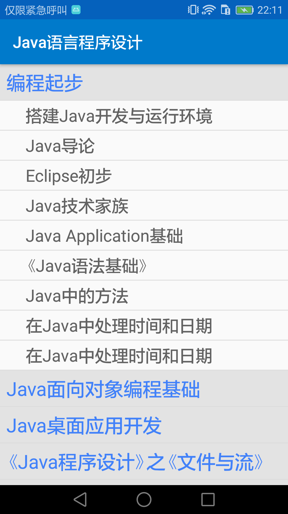
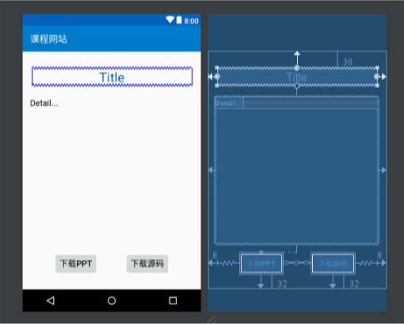

# Android课程设计文档

> 班级：07111504
>
> 学号：1120151811
>
> 姓名：徐恒达

[TOC]

## 一、运行环境

- 运行环境：Android 6.0+ (API 23+)
- 程序组成：course.apk

## 二、开发平台

- 开发平台：Android Studio 3.0.1
- 代码行数：约1300行

## 三、功能说明

金旭亮老师个人网站（www.jinxuliang.com）的一个Android客户端。实现了首页公告浏览、课程浏览、课程资源下载的功能。APP Logo如下。

 

APP分为三个部分：“主页”，“课程”和“我的”，通过下方的导航栏切换。

### 主页

“主页”部分可以浏览网站的首页公告部分，但设置为显示网站公告部分，课程列表等其他部分不显示。可以点击页面中的超链接，将在APP内部打开跳转到的网页。界面如下方左图所示。

### 课程

“课程”部分为一个列表，显示网站上的课程。每一个课程项目包括课程标题，若干条课程介绍和一个Logo图标。如下方中图所示。

点击一个课程条目之后跳转到课程章节列表界面，原网站上的多级树形结构被转换为两级列表，网站中的第一级节点对应APP中的第一级列表项，网站中的其余级节点全部对应为二级列表项归在对应的一级列表项之下，网站中有些资源本身就在一级节点的位置，再APP中也为其添加一个同名的一级列表项而其资源本身对应二级一个单独的二级列表项。这样设计的初衷是想形成一个”章-节“层次的关系，更便于从整体上把握知识体系。如下方又图所示。

点击一级列表项可以展开/收起其对应的二级列表项，点击二级列表项即可跳转到资源详情界面，显示资源标题，资源简介，点击下方的两个按钮分别可以下载对应的PPT和源代码资源。如下下方左图所示。

     

### 我的

本想是设计一个类似网易MOOC客户端一样的APP，用户可以在线逐章节地学习课程，APP自动记录用户的学习进度，那些章节已经学过哪些还没有学，在章节列表中标注展示，同时在第三个模块”我的“中可以看到用户的整体学习情况。可苦于时间有限，个人技术水平不过关，最终没有完成，就在”我的“模块中显示Developing... 还望老师见谅理解...如下方中图。

   


## 四、技术方案

整个APP如果加上最后“我的”部分总共是5部分，程序也对应分为了5个包，分别是Index、CourseList、SectionList、SectionDetail和Me，程序入口MainActivity单独一份。

整个软件数据是来源于爬虫，每个包中的内容基本上遵循了MVC的模式，xml文件是View，爬虫是Model，Activity则扮演Controller的角色。但我对MVC的理解还不是很透彻，更缺少实践的经验，具体的实现中可能有些地方并不规范，也望老师理解见谅...

### 1. MainActivity

> Java File: MainActivity.java
>
> XML File: activity_main.xml

程序入口MainActivity只负责主程程序的框架，界面部分就只由两部分组成，底部的Material Design组件BottomNavigationView和一个空的FrameLayout。

MainActivity.java文件中为BottomNavigationView设置Listener，用户点击三个按钮时分别载入三个Fragment：IndexFragment，CourseListFragment，MeFragment。默认为主页状态，加载IndexFragment。

**activity_main.xml**


**MainActivity.java**

```java
public class MainActivity {
    protected void onCreate() {
        // setContentView...
        initNavigation();
        loadIndex();
    }

    private void initNavigation() {
        BottomNavigationView.OnNavigationItemSelectedListener
                listener = (item) -> {
            switch (item.getItemId()) {
                case R.id.navigation_index:
                    loadIndex();
                    return true;
                case R.id.navigation_course_list:
                    loadCourseList();
                    return true;
                case R.id.navigation_me:
                    loadMe();
                    return true;
            }
            return false;
        };
        navigation.setOnNavigationItemSelectedListener(listener);
    }

    private void loadIndex() { IndexFragment... }
    private void loadCourseList() { CourseListFragment... }
    private void loadMe() { MeFragment... }
}
```

### 2. Index

> Package: Index
>
> Java File: IndexFragment.java, IndexCrawler.java
>
> XML File: fragment_index.xml

IndexFragment界面部分为一个WebView显示网站公告。对这一部分的设定是它只负责向用户显示网站的公告，此时就不能简单地一句loadUrl了事，需要先爬取网页，再抽取公告部分予以显示。

使用OkHttp爬取html内容，在浏览器F12查看网页源代码之后发现网站公告部分在两个class为well的div块中，head部分有5个link标签引用了bootstrap和angular的CSS，用JSoup单独提取这两部分之后送到WebView中显示。

但要注意的是，OkHttp的网络操作不允许在UI线程中进行，必须在一个新的网络线程中进行，而获取到的结果又必须在UI线程中更新到WebView中，这里涉及到线程操作。同时，费时的网络操作本来也应该单独放到一个线程中异步运行，以防止出现界面不响应的情况。

为此，设置了一个`IndexCrawler`类，实现`Runnable`接口，在IndexFragment的`onActivityCreated()`生命周期函数中创建一个IndexCrawler类，把WebView的引用传给它，然后让其自己爬取，分析然后更新。

**IndexFragment.java**

```java
public class IndexFragment extends Fragment {
    public void onActivityCreated() {
            new IndexCrawler(webView).crawler.crawl();
        }
}
```

**IndexCrawler.java**

```java
public class IndexCrawler implements Runnable {
    private WebView webView;
    public IndexCrawler(WebView webView) {
        this.webView = webView;
    }
    public void crawl() {
        new Thread(this).start();
    }
    public void run() {
        // OkHttp...
        // JSoup...
        webView.post(() -> {
            webView.loadData(html);
        });
    }
}
```

### 3. CourseList

> Package: CourseList
>
> Java File: CourseListFragment.java, CourseListCrawler.java,
> ​               CourseListAdapter.java, CourseModel.java
>
> XML File: fragment_course_list.xml, item_course.xml

界面部分为一个Material Design组件RecyclerView，其中的列表项用item_course.xml来定义。这个包中的所有文件都围绕这个RecyclerView展开。

**item_course.xml**

   

`CourseModel`为表示课程信心的数据类，如下的数据字段和响应的Get/Set方法。

**CourseModel.java**

```java
public class CourseModel {
    private int imageId;
    private String id;
    private String title;
    private List<String> descriptions;
}
```

**爬虫**

`CourseListCrawler`类为课程列表的爬虫类，网站上给出的爬取课程列表的Open API失效了，返回404 not fond，因此这里还是使用OkHttp和JSoup了，爬虫活动在单独的网络线程中完成，最终结果为一个`List<CourseModel>`列表。与之前不通的是，爬虫为了将爬到的课程列表返回给Fragment，在爬虫内定义了一个接口`Listener`，包含一个函数，而CourseListFragment则实现了这个Listener接口，并在创建爬虫的时候将自己的引用传给爬虫，当爬虫准备好数据时就调用这个接口函数，实现了异步数据传递。

**数据适配器**

`CourseListAdapter`时RecyclerView的数据适配器，Fragment在加载的时候先初始化一个空的List传给适配器，创建RecyclerView，当爬虫数据准备好时通知Fragment，Fragment再更新Adapter，这样一来所有的组件都以Fragment为核心，只与Fragment打交道，降低了类与类之间的耦合度。

**跳转**

当用户点击列表中的某个课程时，要求跳转到另一个Activity展示课程章节信息，具体的实现过是这样的。再数据适配器中的ViewHolder中为课程项目添加点击的事件响应，通过ViewHolder找到Adapter，通过Adapter找到Fragment，Fragment中再定义一个Listener接口，MainActivity实现它，这样通过Fragment再到Activity，最终从MainActivity跳转。跳转时用bundle传递课程id和标题信息。

**CourseListFragment.java**

```java
public class CourseListFragment extends Fragment
        implements CourseListCrawler.Listener {
    public void onActivityCreated() {
        // Init CourseListAdapter and RecyclerView..
        new CourseListCrawler(this).crawl();.    
    }
    public void courseListCrawlDone(List<CourseModel> courses) {
        this.courses = courses;
        ((Activity) listener).runOnUiThread(() -> adapter.setmDataset(courses));
    }
     public void onCourseClicked(String id, String title) {
        listener.onCourseItemClicked(id, title);
    }
     public interface Listener {
        void onCourseItemClicked(String id, String title);
    }
}
```

**CourseListCrawler.java**

```java
public class CourseListCrawler implements Runnable {
    private Listener listener;
    public CourseListCrawler(Listener listener) {
        this.listener = listener;
    }
    public void crawl() {
        new Thread(this).start();
    }
    public void run() {
        // OkHttp and JSoup...
        listener.courseListCrawlDone(courses);
    }
    public interface Listener {
        void courseListCrawlDone(List<CourseModel> courses);
    }
}
```

CourseListAdapter.java中的内容有些冗长，不在这里展示，其中包含一个ViewHolder内部类，实现了几个Adapter基类的回调方法，是Adapter的典型编范式。

**图片**

网站上的课程列表中是没有课程logo的，在APP中我为了不使得整个应用全是文字看起来很单调，特意为六门课程专门搜了六张图片预置在程序里面。添加图片的方法也比较笨，就是用一个switch语句，判断给出的id是这六门课程中的哪一门，对应上了就那相应的图片设置。因为老师网站上的总的课程种类不会有改动，因此这种方法可以奏效，但如果那天老师又添了一门课，那显示的图片就回事那张默认的java图片了。

### 4. SectionList

> Package: SectionList
>
> Java File: SectionListActivity.java, SectionListCrawler.java, SectionListAdapter.java,
> ​               SectionModel.java, SectionPrimaryModel.java
>
> XML File: activity_section_list.xml, item_section_primary.xml, item_section_secondary.xml

这一部分的功能是实现课程的”章-节“二级列表。如下图所示。


接受从MainActivity传来的bundle数据，获取要显示课程的id和标题，将标题显示在Activity顶端的ActionBar中，id用来爬取课程的具体内容。

SectionModel是章节的数据类，包含如下字段和对应的Get/Set方法。其中type为1表示”章“，对应列表中的一级列表项，type为0表示“节”，对应列表中的二级列表项。因为章和节存储的主要是标题文字和id，用一个type字段就可以比较方便得区分，故没有使用多态。

**SectionModel.java**

```java
public class SectionModel {
    private int type;
    private String id;
    private String title;
    private String pptUrl;
    private String codeUrl;
}
```

**爬虫**

对于爬虫的使用同上文所述，创建爬虫对象，在新的线程中运行，爬虫定义接口，Activity实现接口，爬虫准备好数据后回调返回数据列表。这里有所不同的是使用了网站上给出的一个Open API用来获取模块信息http://jinxuliang.com/openservice/api/courseservice/module/id，获取具体课程资源信息API网站上没有给出，但通过浏览器的F12开发者工具中的Network监控之后发现使用如下链接即可获得，http://jinxuliang.com/course2/api/pptService/id。

**先序遍历文档树**

两个API返回的都是JSON字符串，使用Android中的JSONObject和JSONArray进行处理。这里有一点稍麻烦的是要将层层深入的树形结构转化为一个`List<Section>`的线性结构，采用的方法是对文档数进行先序遍历，即遇到中间节点就继续深入，是叶节点就将其追加到List当中，并附加一些额外的处理。

**渲染RecyclerView**

遍历完成之后就得到了一个线性的List数据，回调SectionListActivity返回数据，Activity将其传给适配器Adapter，更新RecyclerView，根据Section类型的不同使用一级标题item_section_primary.xml或二级标题item_section_secondary.xml样式，这就得到了一个两级的章节列表。

**章节展开/折叠**

但这样的列表是静态的，要实现的目标是点击一级标题后可以收起/展开其下的二级标题，因为这一功能是后来添加的，就缺少了开始时的整体规划，加之时间又有些紧张，就临时加了一个SectionPrimaryModel数据类来存储章标题和它所有的节标题，这样一来就是数据有些冗余，但折叠/展开的功能最终还是成功实现了。

**跳转**

最后要实现的就是点击二级标题跳转到显示资源详情的Activity，同上文，在Adapter的ViewHolder中添加事件响应代码，层层上传，最后由SectionListActivity跳转到SectionDetailActivity，传递标题和id数据。

### 5. SectionDetail

> Package: SectionDetail
>
> Java File: SectionDetailActivity.java, SectionDetailCrawler.java
>
> XML File: activity_section_detail.xml

本部分实现一个界面，显示一个具体资源的标题和介绍，并提供下载PPT和源代码的按钮链接，最终效果设计时的情形如下图所示。

 

有了前面的经验，这一部分实现起来就比较轻松了。启动SectionDetailActivity，获取传来的id和title数据，启动爬虫，从这个API获取课程描述http://jinxuliang.com/openservice/api/courseservice/resource/id//description?needTxt=true，从这个API获取下载链接http://jinxuliang.com/course2/api/pptService/，爬虫准备好数据之后回调Activity传回数据，注意UI线程和网络线程，这一部分就实现了。

点击“下载PPT”或“下载源码”按钮后，要实现调用操作系统功能开始下载，同样借助Intent，比如下载PPT的部分如下。

```java
@OnClick(R.id.btnPPT)
public void downloadPPT() {
    Uri uri = Uri.parse(pptUrl);
    Intent intent = new Intent(Intent.ACTION_VIEW, uri);
    startActivity(intent);
}
```

## 五、技术亮点

- **使用了MVC的设计模式**：整体上是爬虫作为Model，xml文件作为View，Activity或Fragment作为Controller。
- **使用线程将前后台分开**：UI线程负责整体逻辑，爬取数据的工作放在网络线程中执行。
- **灵活使用回调函数**：不论是很多Android组件的设计还是APP中的一些逻辑都不可避免地用到了回调，使用回调让模块间更好地通信。
- **使用了多个第三方框架**：控件的绑定使用了ButterKnife，网络爬虫使用了OkHttp，html解析使用了JSoup。
- **使用了Material Design组件**：底部导航栏BottomNavigationView和列表RecyclerView。
- **课程章节结构**：将老师网站上树形的课程结构转为了二级列表的形式，一方面锻炼了爬虫和处理数据的能力，另一方面我个人觉得章节的形式可能更有助于把握课程整体结构，树形结构层次一多可能就有点晕了。

## 六、课程建议

​       其实我本来的打算是想做一个类似QQ或者微信这样的聊天软件，自己写前端自己写后端，正好学期也学了软件工程，就想正儿八经地需求分析、概要设计、详细设计、编码、测试都规范地走一遍，所有的代码先设计在开码，UML图，文档一个不拉，为此我还找了一个UML软件，还找了一些Java后端的资料，了解了一下REST，又学了一下Spring，打算用WebSocket实现聊天软件的实时同步。可是，理想很丰满现实很骨干，我前面的进度有点慢了，中途又有事耽误了一阵子，结果进度就赶不上了。而且越深入，越觉得Android体系的庞大，心里想的很简单，但真正实践起来就事一个细节一个细节地扣，必须要一步一个脚印的前进才行。

​       聊天软件做不成了，因为我实在抽不出时间再去学后端了，但我还是不甘心，想做一个网络应用，思来想去，就只能是爬虫了。又一想，不用到处找，您的网站不就是最好的素材吗，于是我就对您的网站“开刀” 

了。瞬间就觉得比聊天软件难度小多了，也轻松了不少，虽然最后还没有全部完成...不过那一部分也可以认为是留下的一个扩展接口吧。我做您网站的APP，就是觉得任务难度我还能接受，还能做出点东西来，比较适合我，也没有想迎合您的口味的意思，同时，我拿您的网站“开了刀”，做得不好，很多细节都没有处理，也没有后台数据缓存，也没有针对不同的设备尺寸考虑，代码也不规范，界面也不漂亮，还希望老师您不要生气。

​       其实我大一下学期的时候，也就是2015-2016学年的第二学期，就听过您的课，当时您在教人文学院的Web课，因为他们做得不好您有一次还挺生气批评了他们，当时我印象特别深刻，受到了很大的启发，也从那时起就特别敬佩您，回去就关注了您的知乎。您不像其他老师那样教书就只是原原本本得地教书，您更愿意跟同学们分享您的人生经验，生活体会，您交给学生的不仅是知识，也有面对生活的态度，不论做什么事，想要做得比别人好，就要付出艰辛的努力。直到大三，有您的Java课，无论是从课的角度还是老师的角度，我都毫不犹豫地选了。我挺喜欢编程的，也挺佩服老师。

​       本来是课程建议，我却扯了好多我自己的想法，但这些就是我内心的真实想法，也是一直想跟您交流的。说实话，这个课程设计我时间安排得不是很好，写这篇文档的时候已经是很晚很晚接近deadline了，而且我现在有点困得不行了，但我坚持把这段课程建议写完，因为这是我内心的想法。按要求还有一个简要开发过程要写的，但我实在太困了，老师原谅我不写这一部分了吧。这篇文档肯定有不少笔误或者语句逻辑不顺的地方，因为我写到后面实在太困了，还望老师体谅。

​       您上课说把项目托管到github上，我的项目中间有些变化，后来时间又有些紧张就没有即时push，直到最后我才传上去的，但我保证项目里的每行代码都是我自己亲自写的。Github链接：https://github.com/DaDaMrX/AndroidApp


